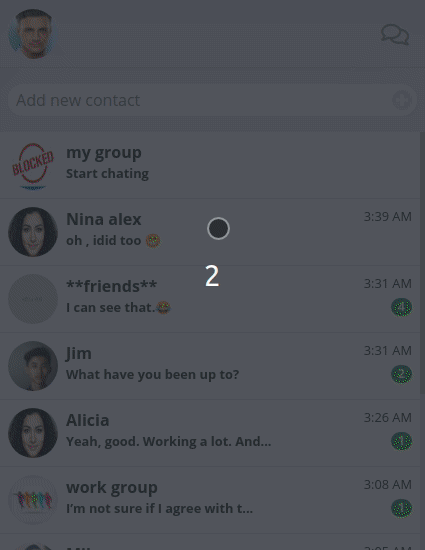

# fake-whatsapp

fake-whatsapp is a real time chat app, that designed like whatsapp

### [Demo](https://fake--whatsapp.herokuapp.com/)

### Installation

- clone the repo
- install packages for express -`npm install`
- install packages for react -`cd public` -`npm install`
- run the dev mode -`npm run start:dev`

### Features!

- Like any simple chat app it allow user to chat with other users directly or in groups
- designed like whatapp
- have 2 themes dark and light

### Tech

fake-whatsapp uses a number of open source projects to work properly:

- [Express](https://expressjs.com/) - Web framework for Node.js
- [React](https://reactjs.org/) - JavaScript library for building user interfaces
- [socket-io](https://socket.io/) - real-time sockets
- [react-redux](https://react-redux.js.org/) - Official React bindings for Redux
- [bootstrap](https://getbootstrap.com/) - front-end open source toolkit
- [emoji-picker-react](https://www.npmjs.com/package/emoji-picker-react) - npm package for react emoji picking
